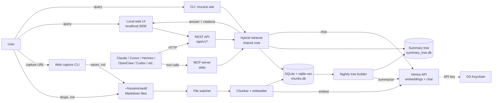

# Murano — Project Plan

**Working name:** Murano
**License:** MIT
**Stack:** Python 3.11+ / SQLite + sqlite-vec / FastAPI + htmx / Venice API direct
**Status:** Greenfield, clean-room rebuild of the OpenHuman "memory tree" concept (no GPL code imported)

> Drop this file into a new chat as kickoff context. Tell the agent: **"Read `@MURANO_PLAN.md` and start Phase 1."**

---

## 1. What it is

A private, local-first personal knowledge base. You drop Markdown files into a vault (Obsidian-compatible), Murano chunks them, embeds them via Venice, indexes them in SQLite, and lets you chat with your knowledge. URLs can be captured to the vault. Optional hierarchical summary tree for thematic retrieval.

Murano is also an **MCP server**, so agent frameworks (Claude Desktop, Cursor, Hermes Agent, OpenClaw, Codex CLI, etc.) can use it as their persistent memory layer.

No backend service, no proxy, no telemetry — your data, your Venice API key, your machine.

## 2. What it is NOT

- Not an agent framework. Murano is the memory/retrieval layer that agent frameworks reason over.
- Not a fork of OpenHuman. Clean-room rebuild of the *concept* from public docs; zero GPL code imported.
- Not a SaaS. There is no Murano backend; the only outbound network call is to `api.venice.ai`.

## 3. Clean-room hygiene

- All implementation written from scratch based on the public OpenHuman gitbook docs and standard RAG / hierarchical summarization patterns (RAPTOR etc.).
- No source code copied from `tinyhumansai/openhuman`.
- No use of the names "OpenHuman" or "Tiny Humans" or their logos.
- Vault format deliberately Obsidian-compatible (a generic Markdown vault).
- Dependencies are all permissive (MIT / Apache / BSD); license check baked into CI in Phase 7.

## 4. Architecture



The retriever core is shared across CLI, HTTP API, and MCP — one implementation, three transports. The only external call is to Venice.

## 5. Tech stack

- **Python 3.11+**, managed with `uv`
- **`openai` SDK** with `base_url="https://api.venice.ai/api/v1"`
- **`sqlite-vec`** for vector search inside SQLite
- **`watchfiles`** for real-time vault watching
- **`trafilatura`** for web page main-content extraction
- **`typer`** for the CLI
- **`fastapi`** + **`htmx`** + **`jinja2`** for the local web UI (no build step)
- **`mcp`** (official Python MCP SDK) for the agent integration server
- **`keyring`** for OS keychain storage of the Venice API key
- **`apscheduler`** for the nightly summary-tree rebuild
- **`pydantic-settings`** for config
- **`pytest`** + **`ruff`** for tests/lint

## 6. Defaults (all overridable via config)

| Setting | Default |
| --- | --- |
| Chat model | `qwen-3-6-plus` (resolved against `/v1/models?type=text` at startup) |
| Embedding model | `text-embedding-qwen3-8b` (Qwen3 Embedding 8B, 4096 dims, 32K max input tokens; resolved against `/v1/models?type=embedding`) |
| Web UI port | **3000** (per user rule) |
| Vault root | `~/murano/vault/` (override: `MURANO_VAULT` env or `--vault` flag) |
| Data root | `~/.murano/` (chunks.db, summary_tree.db, logs/, config.toml) |
| Chunk size | ~512 tokens, ~64 token overlap, split on Markdown headings first |
| Retrieval | hybrid: vector top-K + BM25 lexical, weighted blend |
| Summary tree rebuild | nightly at 03:00 local time |
| API key storage | OS keychain via `keyring` |
| Telemetry | none, ever |

## 7. Repo layout

```
murano/
├── pyproject.toml
├── README.md
├── LICENSE                    # MIT
├── src/murano/
│   ├── __init__.py
│   ├── cli.py                 # typer entrypoint: murano <command>
│   ├── config.py              # paths, settings, keychain access
│   ├── venice.py              # openai client configured for Venice
│   ├── vault/
│   │   ├── watcher.py
│   │   └── chunker.py
│   ├── index/
│   │   ├── db.py              # SQLite + sqlite-vec schema/setup
│   │   ├── embed.py
│   │   └── search.py
│   ├── tree/
│   │   ├── cluster.py
│   │   ├── summarize.py
│   │   └── build.py
│   ├── capture/
│   │   ├── web.py
│   │   └── bookmarklet.html
│   ├── chat/
│   │   ├── retriever.py       # shared retrieval core
│   │   └── answer.py
│   ├── api/
│   │   ├── server.py          # FastAPI app, port 3000
│   │   ├── routes.py          # /api/v1/* endpoints
│   │   └── schemas.py
│   ├── mcp/
│   │   └── server.py          # MCP server over stdio
│   └── ui/
│       ├── routes.py
│       ├── templates/
│       └── static/
├── integrations/
│   ├── README.md
│   ├── claude-desktop/mcp-config.json
│   ├── cursor/mcp-config.json
│   ├── hermes/murano-skill.md
│   └── openclaw/murano-skill.yaml
├── scripts/
│   └── dev.sh                 # kills prior processes, starts dev server on 3000
└── tests/
```

User data:

```
~/murano/vault/                # canonical source of truth, Obsidian-compatible
~/.murano/                     # derived index (rebuildable from vault)
├── chunks.db
├── summary_tree.db
├── config.toml
└── logs/
```

**Key principle:** the vault is canonical, `~/.murano/` is just derived index. Delete `~/.murano/` and `murano reindex` rebuilds everything.

## 8. CLI surface (v1)

```bash
# Setup
murano init
murano config set-key
murano config show
murano models
murano ping

# Indexing
murano index
murano watch
murano reindex

# Capture
murano capture <url>

# Query
murano ask "<query>"

# Servers
murano serve                  # FastAPI UI + REST API on http://localhost:3000
murano serve --restart        # kill prior process on 3000, then serve
murano mcp                    # MCP server over stdio (for agent frameworks)

# Tree
murano tree rebuild
murano tree show
```

## 9. HTTP API (Phase 6, used by UI and external agents)

All endpoints under `/api/v1/`. OpenAPI auto-generated by FastAPI at `/docs`.

| Method | Path | Purpose |
| --- | --- | --- |
| `POST` | `/api/v1/ask` | Streaming RAG answer with citations |
| `POST` | `/api/v1/search` | Top-K chunks for a query (no LLM call) |
| `POST` | `/api/v1/capture` | Capture a URL into the vault |
| `GET`  | `/api/v1/chunks/{id}` | Fetch a specific chunk |
| `GET`  | `/api/v1/themes` | Walk the summary tree |
| `GET`  | `/api/v1/health` | Status check |

## 10. MCP tools (Phase 3.5)

| Tool | Description |
| --- | --- |
| `search_kb(query, k=10)` | Return top-K chunks with citations |
| `ask_kb(query)` | Full RAG answer with streaming |
| `capture_url(url)` | Ingest a web page into the vault |
| `list_themes(level=1)` | Walk the summary tree |
| `get_chunk(id)` | Fetch a specific chunk by ID |

## 11. Phases

### Phase 1 — Skeleton + Venice plumbing
- `pyproject.toml`, package layout, `typer` CLI scaffold
- `murano init` creates `~/murano/` + `~/.murano/`
- `murano config set-key` stores Venice API key in OS keychain via `keyring`
- `murano ping` validates connectivity and resolves model IDs against `/v1/models`

**Acceptance:** `murano ping` prints `Venice OK, chat=qwen-3-6-plus, embed=text-embedding-qwen3-8b`.

### Phase 2 — Vault → chunks → embeddings
- Markdown-aware chunker (split on H1/H2/H3, size-cap ~512 tokens, ~64 overlap)
- `sqlite-vec` schema: `chunks(id, file_path, heading_path, content, embedding BLOB, mtime, hash)`
- `murano index` walks vault, embeds in batches
- `murano watch` runs `watchfiles` loop; idempotent via content hash

**Acceptance:** dropping a `.md` file in the vault is searchable within 5 seconds.

### Phase 3 — Ask (flat RAG)
- `murano ask "<query>"` — embed query → vector search top-K → assemble prompt → Venice chat completions stream
- Inline citations as Obsidian-style `[[file#heading]]` links

**Acceptance:** answer streams with at least one inline citation linking to a vault file.

### Phase 3.5 — MCP server
- `murano mcp` exposes `search_kb` and `ask_kb` over stdio
- `integrations/claude-desktop/mcp-config.json` and `integrations/cursor/mcp-config.json` ready to drop in
- Murano is usable inside Claude Desktop, Cursor, Hermes Agent, OpenClaw, Codex CLI **before** the web UI exists

**Acceptance:** MCP config in Claude Desktop or Cursor exposes both tools and an agent can query the vault.

### Phase 4 — Web capture
- `murano capture <url>` → `trafilatura` extracts main content → writes `~/murano/vault/web-captures/YYYY-MM-DD-<slug>.md` with YAML frontmatter
- Watcher picks it up automatically
- Add `capture_url` MCP tool
- Optional: bookmarklet that POSTs to `localhost:3000/api/v1/capture`

**Acceptance:** capture a URL, then ask about it, get a cited answer from the captured file.

### Phase 5 — Hierarchical summary tree (the "memory tree")
- Cluster chunks by embedding similarity (k-means, `k = sqrt(N_chunks)` starting point)
- LLM-summarize each cluster via Venice
- Embed summaries → next level; build 2–3 levels
- Stored in `summary_tree.db`
- Hierarchical retrieval: query → top-level summary match → drill down → leaf chunks; prompt includes summaries (context) + chunks (citations)
- `apscheduler` nightly rebuild; `murano tree rebuild` for on-demand
- Add `list_themes` and `get_chunk` MCP tools

**Acceptance:** thematic queries ("what are my main interests in X") return summary-grounded answers.

### Phase 6 — Web UI + REST API
- FastAPI on `localhost:3000`
- `scripts/dev.sh` kills any prior process on port 3000 (macOS: `lsof -ti:3000 | xargs -r kill -9; pkill -f 'murano serve'`)
- REST API at `/api/v1/*` with OpenAPI docs at `/docs`
- htmx single-page chat with streaming
- Clickable citations → open `.md` file in default editor
- Vault file browser
- Settings page

**Acceptance:** end-to-end query/answer with streamed citations at `http://localhost:3000`.

### Phase 6.5 — Reference skill files
- `integrations/hermes/murano-skill.md` — Hermes Agent skill
- `integrations/openclaw/murano-skill.yaml` — OpenClaw skill
- `integrations/README.md` — setup guide per framework

**Acceptance:** each skill file works against a local Murano instance.

### Phase 7 — Quality of life
- Token + cost tracker (log to `~/.murano/logs/usage.jsonl`)
- `murano export` / `murano backup` (zip vault + config; never the API key)
- Optional local-embedding fallback via `sentence-transformers` (`all-MiniLM-L6-v2`)
- License check in CI (no GPL/AGPL deps)
- Optional second source: pick one of {Gmail, Notion, RSS} — OAuth tokens stored locally in OS keychain only

## 12. User rules baked in

- **Web UI runs on port 3000** (set in `api/server.py`).
- Before starting the dev server, `scripts/dev.sh` kills any existing process on port 3000 and any prior `murano serve` instance. macOS equivalent of the user's Windows `taskkill /F /IM node.exe` rule: `lsof -ti:3000 | xargs -r kill -9 ; pkill -f 'murano serve'`.
- The `murano serve --restart` flag wraps this.

## 13. Out of scope (NOT building)

- Mascot, TTS, voice mode
- 118 third-party integrations
- A backend service of any kind
- Sentry / telemetry / analytics
- Plugin system inside Murano (we plug *into* other frameworks instead)
- Agent tool-calling loop inside Murano (we are the memory)
- Multi-user / teams / sharing
- Mobile
- Cloud sync (use Dropbox/iCloud/Syncthing on `~/murano/vault/` if desired)

## 14. v1 acceptance criteria

- `murano init && murano config set-key && murano index && murano serve` gets from zero to a working chat-with-your-knowledge UI on `localhost:3000`.
- File changes in the vault reflect in answers within seconds.
- `murano capture <url>` ingests web articles.
- Hierarchical summary tree rebuilds nightly.
- `murano mcp` works as an MCP server in Claude Desktop and Cursor.
- Reference skill files for Hermes and OpenClaw are present.
- No outbound network calls except to `api.venice.ai`.
- The Venice API key never leaves the OS keychain except in `Authorization:` headers to `api.venice.ai`.
- No GPL/AGPL deps.

## 15. Deferred decisions

- Hybrid retrieval weights — tune empirically in Phase 3.
- k-means `k` — start with `sqrt(N_chunks)`, tune in Phase 5.
- Second source connector choice — Phase 7.
- PyPI / homebrew publishing — after v1.
- Adding a `murano agent` mode with its own tool-calling loop — out of scope for v1.

## 16. Kickoff in the new chat

In the new conversation, paste:

> Read `@MURANO_PLAN.md`. Start Phase 1. Confirm the plan back to me in one paragraph, then create the project skeleton.

The new agent should:
1. Read this file.
2. Confirm understanding.
3. Begin Phase 1: `pyproject.toml`, package skeleton, CLI scaffold, `murano init`, `murano config set-key`, `murano ping`.